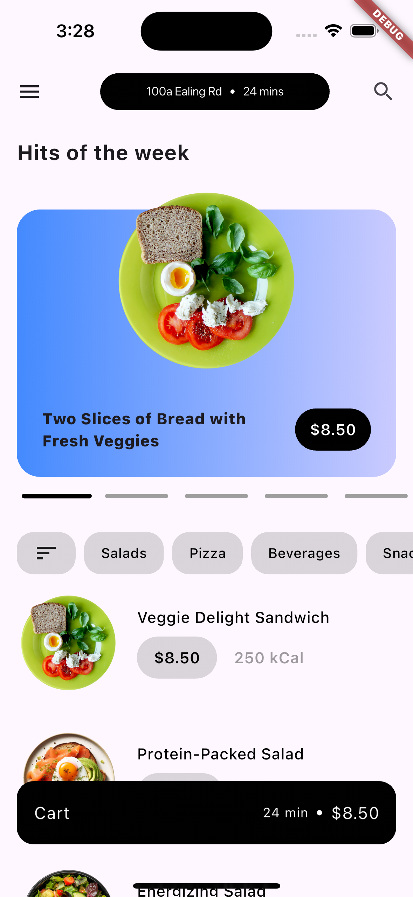

# Food Delivery App

🛍️ **Food Delivery App - Flutter UI Challenge**

This repository showcases a Food Delivery App developed with Flutter, aiming to replicate a sophisticated UI inspired by a design found on https://dribbble.com/shots/15082658-Food-Delivery-App.

## Flutter & Dart Versions
- **Flutter**: 3.24.3 (channel stable)
- **Dart**: 3.5.3
- **DevTools**: 2.37.3
- **JDK**: Version 17

## Key Features

### Home Screen
- Horizontal scrolling list of food items.
- Vertical list of available food items.
- Detailed food item view using a bottom sheet.

### Cart Screen
- View all items added to the cart.
- Add or remove food items from the cart.

## Technical Approach
### State Management
- All app states are managed locally, eliminating the need for external APIs.

## Project Highlights
This project demonstrates how Flutter can be utilized to effectively implement complex UI designs while providing smooth functionality for a food delivery experience.

## Getting Started
To get a local copy up and running, follow these simple steps:

1. **Clone the repository**
   ```bash
   git clone https://github.com/yourusername/fooddeliveryapp.git

2. **Navigate into the directory**
   ```bash
   cd fooddeliveryapp

3. **Install dependencies**
   ```bash
   flutter pub get

4. **Run the app**
   ```bash
   flutter run

<table>
  <tr>
    <td></td>
    <td></td>
    <td></td>
    <td></td>
  </tr>
</table>
